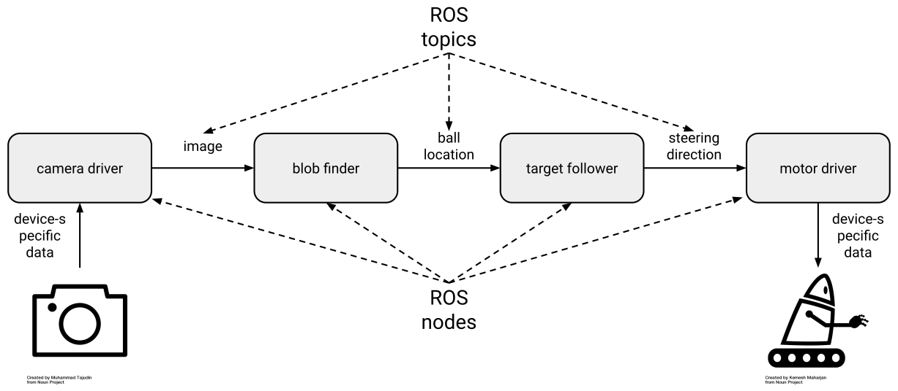

ROS Concepts and Design Patterns
===

As we said, learning about ROS is similar to learning about an
automobile. In fact, a car is a lot like a robot (and sometimes it
really is a robot; cf. the large and active self-driving vehicle
industry). A modern automobile comprises many parts that are
connected to each other. The steering wheel is connected to the front
axle, the brake pedal is connected to the brake calipers, the oxygen
sensor is connected to the fuel injectors, and so on. From this
perspective, a car is a *distributed system*: each part plays a
well-defined role, communicating (whether electrically or mechanically)
as needed with other parts, and the result of that symphony-like
coordination is a working vehicle.

A key philosophical tenet of ROS is that robotics software should also
be designed and developed as a distributed system. We aim to separate
the functions of a complex system into individual parts that interact
with each other to produce the desired behavior of that system. In ROS
we call those parts *nodes* and we call the interactions between them
*topics* (and sometimes *services*, but we will get to that).

The ROS Communication Graph
---

Imagine we are building a wheeled robot that chases a red ball. This
robot needs a camera with which to see the ball, a vision system to
process the camera images to figure out where the ball is, a control
system to decide what direction to move, and some motors to move motors
to move the wheels to allow it to move toward the ball. Using ROS we
might construct the system like so:

This design separates the software into four ROS *nodes*: two device
drivers and two algorithms. Those nodes communicate with each other as
shown, via three ROS *topics*. We call this structure a *ROS
communication graph*: the nodes are the graph vertices and the topics
are the graph edges. You can tell a lot about a ROS system by examining
its communication graph.

The camera driver node is responsible for handling the details of
interacting with the physical camera, which might happen through a
custom USB protocol, through a vendor-provided library, or in some other
way. Whatever those details, they are encapsulated inside the camera
driver node, which presents a standard *topic* interface to the rest of
the system. As a result, the blob finder node does not need to know
anything about the camera; it simply receives image data in a standard
format that is used for all cameras in ROS. The output of the blob
finder is the detected location of the red ball, also in a standard
format. Then the target follower node can read in the ball location and
produce the steering direction needed to move toward the ball, again in
a standard format. Finally, the motor driver node's responsibility is to
convert the desired steering direction into the specific instructions
necessary to command the robot's wheel motors accordingly.

This design approach offers several key benefits:

- **Substitution**: If we decide to upgrade the robot's camera, we need
  only modify or replace the camera driver node. The rest of the system
never knew the details of the camera anyway.  Similarly, if we find a
better blob finder node, then we can just swap it in for the old one and
nothing else changes.
- **Reuse**: A well-designed blob finder node can be used today on this
  robot to chase the red ball, then reused tomorrow on a different robot
to orange cat, and so on. Each new use of a node should require only
configuration (no code) changes.
- **Collaboration**: By cleanly separating concerns between nodes, we
  let our blob finder expert do her work independently of the target
follower expert, with neither of them bothering the device driver
expert. It is often the case that a robot application requires the
combined expertise of many people, and it would be difficult to
overstate the importance of ensuring that they can each contribute
confidently and efficiently.
- **Introspection**: Because the nodes are explicitly communicating with
  each other via topics, we can listen in. So when the robot fails to
chase the red ball, and we think that the problem is in the blob finder,
we can use developer tools to visualize, log, and play back that nodes
inputs and outputs. The ability to introspect a running system in this
way is instrumental to being able to debug it.
- **Fault tolerance**: Say that the target follower node crashes because
  of a bug. If it is running in its own process, then that crash will
not bring down the rest of the system, and we can get things working
again by just restarting the target follower. In general with ROS 2 we
have the choice to run nodes in separate processes, which allows for
such fault tolerance, or run them together in a single process, which
can provide higher performance (and of course we can mix and match the
two approaches).
- **Language independence**: It can happen that our blob finder expert
  writes her computer vision code in C++, while our target follower
expert is dedicated to Python. We can accommodate those preferences
easily by just running those nodes in separate processes. In ROS, it is
perfectly reasonable, and in fact quite common, to mix and match the use
of languages in this way.
