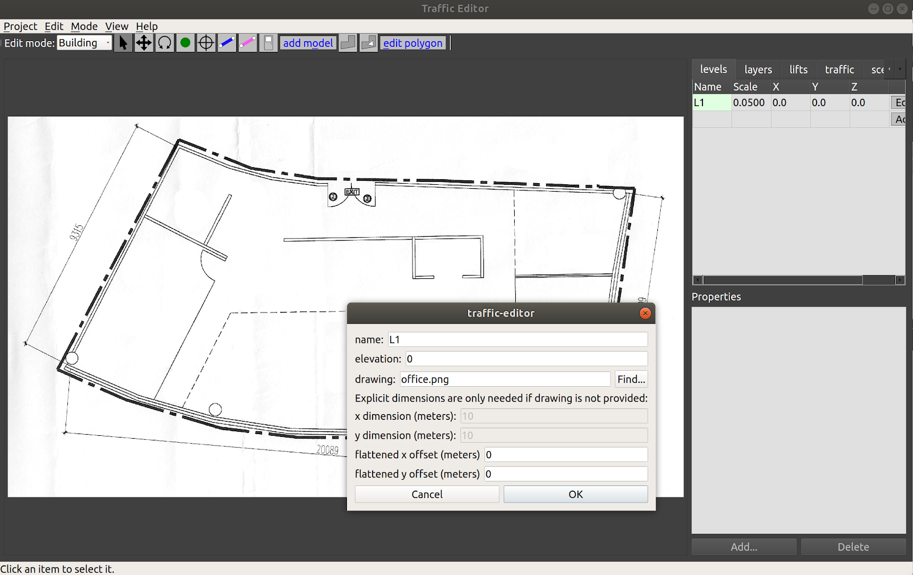
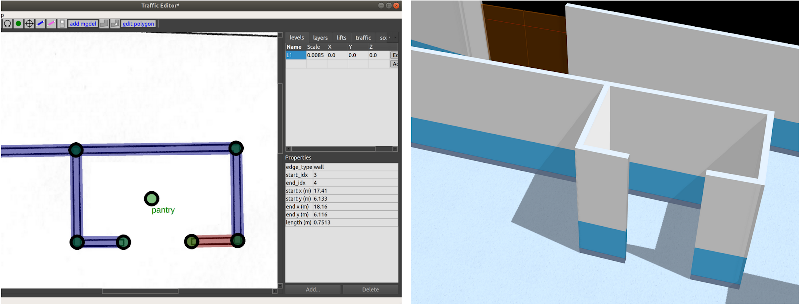
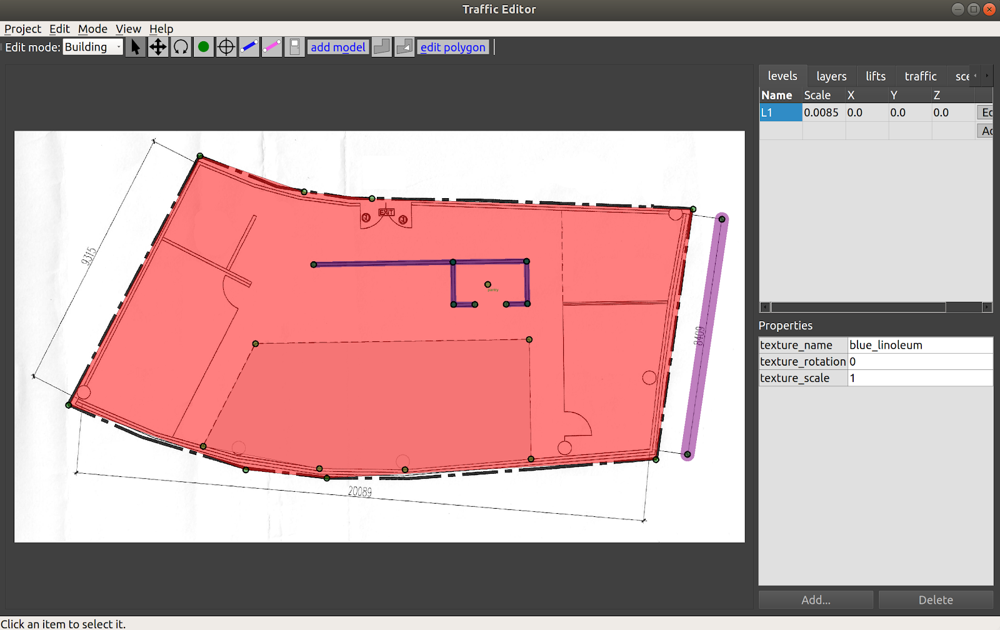
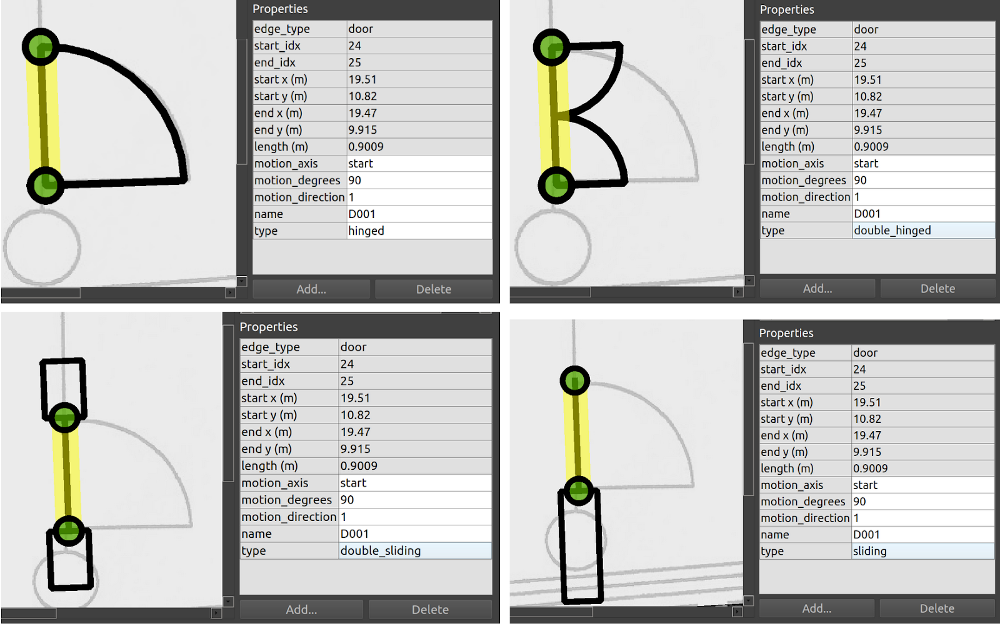
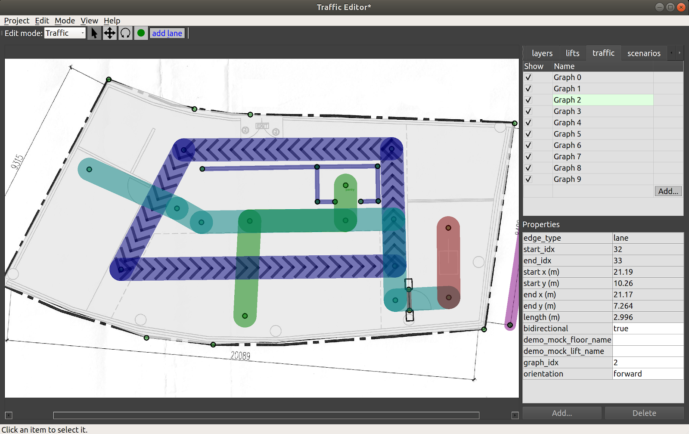

# Traffic Editor

In this section, we shall describe the traffic-editor GUI and simulation tools.

## Introduction and Objectives

Traffic management of heterogeneous robot fleets is non-trivial. One of the
challenges with coordinated management arises from varying semantics in
information models used across fleets. Representations of waypoints, lanes,
charging/docking stations, restricted zones, infrastructure  systems such as
doors & lifts among others are subject to vendor's discretion. However,
standardized conventions that convey the capabilities and intentions of fleets
in a shared facility are quintessential for planning. Multi-agent participants
in other modes of transportation such as roadways collectively adhere to a set
of rules and conventions which minimize chaos. More importantly, they allow for
a new participant to readily integrate into the system by following the
prescribed rules. Existing agents can accommodate the new participant as its
behavior is apparent. Traffic conventions for multi-robot systems do not exist.
The objective of the `traffic_editor` is to fill this gap by expressing the
intentions of various fleets in a standardized, vendor neutral manner through a
graphical interface. Collated traffic information from different fleets can then
be exported for planning and control. A secondary objective and benefit of the
`traffic_editor` is to facilitate generation of 3D simulations worlds which
accurately reflect physical environments.

## Overview

The `traffic_editor` [repository](https://github.com/osrf/traffic_editor) is home to the `traffic_editor` GUI and tools to auto-generate simulation worlds from GUI output. The GUI is an easy to use interface which can be used to create and annotate 2D floor plans with robot traffic along with building infrastructure information. In the case there are existing floor plans of the environment, the `traffic_editor` is able to import those images for faster layout and floor generation.
The functionality of the GUI is to load and annotate 2D floor plans with robot
traffic along with building infrastructure information. While readily available
3D models of sites would ease the process running simulations, in practice these
are often unavailable or do not exist for distribution from facility owners. Floor
plans however are relatively easier to access. Hence, the `traffic_editor` is
designed to work with such 2D drawings to help build up accurate digital
representations of facilities.

The `traffic_editor` GUI projects are stored as `yaml` files with
`.project.yaml` file extensions. The template of a project file is seen below.
The structure essentially breaks a project into `.building.yaml` files that may
represent various buildings that make up a given site. Populating the `filename`
tag with the appropriate `.building.yaml` file will set the editor to load and
apply any annotations to this file.

```yaml
building:
  filename: ""
name: ""
traffic_maps:
  {}
version: 1
```

Each `.building.yaml` file encompasses several attributes for each level in
the site as annotated by the user. A detailed description of the various
options are discussed in the subsequent section.
 
```yaml
levels:
  L1:
    doors:
      - []
    drawing:
      filename:
    fiducials:
    elevation: 0
    flattened_x_offset: 0
    flattened_y_offset: 0
    floors:
      - parameters: {}
        vertices: []
    lanes:
      - []
    layers:
      {}
    measurements:
      - []

    models:
      -{}
    vertices:
      {}
    walls:
      {}
lifts:
  {}
name: building

```

## GUI Layout
The layout of the `traffic_editor` comprises of a `Main Toolbar`, a `Working Area`
and a `Sidebar` as seen in the figure below.


The editor operates in three modes as selectable from the `Edit mode` dropdown
list in the `Main Toolbar` or using shortkeys:
* **Building (Ctrl + B):** to annotate _walls_, floors (_polygons_), _doors_,
  _measurements_ to set the scale of the drawing and _fiducials_ to align levels
  for multi-level simulations.  
* **Traffic (Ctrl + T):** to annotate traffic lanes of various robots on each level
* **Scenario (Ctrl + E):** to define special regions of interest on a level. In
  larger facilities robot traffic may be limited to certain areas only. Hence,
  it may be more meaningful to generate simulation worlds of these special
  regions alone which can be specified in this mode.

Each mode has a unique set of tools while the following are common:
|                    Icon                    |  Name  | Shortkey |               Function               |
|:------------------------------------------:|:------:|:--------:|:------------------------------------:|
|  | Select |   `Esc`  | Select an entity in the `Working Area` |
|    |  Move  |    `m`   |  Move an entity in the `Working Area`  |
|  | Rotate |    `r`   | Rotate an entity in the `Working Area` |

The `SideBar` contains multiple tabs with various functionalities:
* **levels:** to add a new level to the building using a floor plan
* **layers:** to overlap other images such as lidar maps over the level
* **lifts:** to configure and add lifts to the building
* **traffic:** to add navigation graphs to the level which are a collection of
  lanes occupiable by a fleet of robots. Each graph corresponds to a single fleet
  operating in the facility.
* **scenarios:** to configure scenarios for simulation

The `Working Area` is where the levels along with their annotations are
rendered. The user is able to zoom via the `Mouse Scroll` and pan the view by
holding the `Scroll Button` and moving the mouse cursor.

## Annotation Guide
The objective of this section is to walk through the process of annotating
facilities while highlighting the capabilities of the `traffic_editor` GUI.

To create a new `traffic_editor` project, setup a working directory as shown
below with empty `.project.yaml` and `.building.yaml` files.

```
maps/
├── tutorial.project.yaml
└── tutorial.building.yaml
```

Next launch the traffic editor from a terminal window
(source workspace if `traffic_editor` is built from source).

```bash
traffic-editor tutorial.project.yaml
```

To configure the project to work with the `tutorial.building.yaml` file, locate
the path to this file from the dialog box that opens from from clicking `Edit ->
Project Properties`. The project can be assigned a name from the same box.
Saving (`Ctrl + S`) the project will write the configuration to the
`tutorial.project.yaml` file while populating the `tutorial.building.yaml` file
with a basic template. Additional `.building.yaml` files may be created for
other building in the site. The project configuration can be updated to
reference the new file accordingly.

### Adding a level
A new level in the building can be added by clicking the `Add` button in the
`levels` tab of the `Sidebar`. The operation will open a dialog box where the
`name`, `elevation` (in meters) and path to a 2D `drawing` file (`.png`) can be
specified. In most use cases, the floor plan for the level is used as the
drawing. If unspecified, the user may explicitly enter dimensions of the level
in the fields provided.



In the figure above, a new level `L1` at `0m` elevation and a floor plan has
been added as reflected in the `levels` tab. A default scale fo `1px = 5cm` is
applied. The actual scale can be set by adding a measurement. Any offsets
applied to align levels will be reflected in the `X` and `Y` columns. Saving the
project will update the `tutorial.building.yaml` files as seen below.
```yaml

levels:
  L1:
    drawing:
      filename: office.png
    elevation: 0
    flattened_x_offset: 0
    flattened_y_offset: 0
    layers:
      {}
lifts:
  {}
name: building
```
### Adding a vertex
|                    Icon                    | Shortkey |
|:------------------------------------------:| :-------:| 
| | `v` |

A vertex is a fundamental component of multiple annotations. Walls,
measurements, doors, floor polygons and traffic lanes are created from two or
more vertices. To create a vertex, click on the vertex icon in the `Main
Toolbar` and anywhere on the canvas. The default attributes of a vertex are its
coordinates along with an empty name field. Additional attributes may be added
by clicking the `Add` button in the figure. Short descriptions of these are
presented below.
* **is_partking_spot:** if true and if the waypoint is part of a traffic lane,
  the `rmf_fleet_adapter` will treat this as a _holding point_ during path
  planning, ie, the robot is allowed to wait at this waypoint for an indefinite
  period of time.
* **is_charger:** if true and if the waypoint is part of a traffic lane, the
  `rmf_fleet_adapter` will treat this as a charing station.
* **dock_name:** if specified and if the waypoint is part of a traffic lane, the
  `rmf_fleet_adapter` will issue an `rmf_fleet_msgs::ModeRequest` message with
  `MODE_DOCKING` and `task_id` equal to the specified name to the robot as it
  approaches this waypoint.
* **workcell_name [deprecated]:** This attribute was previously used by the
  `rmf_fleet_adapter` to issue an `rmf_dispenser_msgs::DispenerRequest` message
  with `target_guid` equal to the name specified when a robot reached this
  waypoint. In the latest version of `rmf_core` the workcell name is passed via
  the `rmf_task_msgs::Delivery` message. See Chapter [Simulation](simulation.md)
  for more details.
* **spawn_robot_type:** the name of the robot model to spawn at this waypoint in
  simulation. The value must match the model's folder name in the assets
  repository. More details on the robot model and plugin required for simulation
  can be found in [Simulation](simulation.md)
* **spawn_robot_name:** a unique identifier for the robot spawned at this
  waypoint. The `rmf_fleet_msgs::RobotState` message published by this robot
  will have `name` field equal to this value.


Each vertex is stored in the `tutorial.building.yaml` file as a list of
x-coordinate, y-coordinate, elevation, vertex_name and a set of additional
parameters.

```yaml
  vertices:  
    - [1364.76, 1336.717, 0, magni1_charger, {is_charger: [4, true], is_parking_spot: [4, true], spawn_robot_name: [1, magni1], spawn_robot_type: [1, Magni]}]
```
### Adding a Measurement 
|                    Icon                    |
|:------------------------------------------:|
| |

Adding a measurement sets the scale of the imported 2D drawing which is
essential for simulation accuracy. Scalebars or reference dimensions in the
floor plan aid with the process. With the editor in _Building_ mode, select the
_Add Measurement_ tool and click on two points with known dimension. A pink line is
rendered on the map with two vertices at its ends at the selected points. Note:
A measurement line may be drawn by clicking on existing vertices. In this
scenario, no additional vertices are created at its ends.


Selecting the line populates various parameters in the Properties window of the
`Sidebar`. Setting the `distance` parameter to the physical distance between the
points (in meters) will then update the `Scale` for the level. Save the project
and reload to see the changes reflected.


The above process adds two `vertices` and a `measurement` field to the
`tutorial.building.yaml` file as seen below. For the measurement field, the
first two elements represent the indices of vertices representing the ends of
the line. The `distance` value is stored in a sub-list of parameters.

```yaml
levels:
  L1:
    drawing:
      filename: office.png
    elevation: 0
    flattened_x_offset: 0
    flattened_y_offset: 0
    layers:
      {}
    measurements:
      - [1, 0, {distance: [3, 8.409]}]
    vertices:
      - [2951.728, 368.353, 0, ""]
      - [2808.142, 1348.9, 0, ""]

lifts:
  {}
name: building
```

### Adding a wall
|                    Icon                    | Shortkey |
|:------------------------------------------:| :-------:| 
| | `w` |

To annotate walls in the map, select the _Add Wall_ icon from the `Main Toolbar`
and click on consecutive vertices that represent the corners of the wall. The
selection process is continuous and can be exited by pressing the `Esc` key.
Blue lines between vertices are rendered on the map which represent the drawn
walls. If the corner vertices are not present, they will automatically be
created when using this tool. Meshes of the annotated walls are automatically
generated during 3D world generating using `building_map_generator`. By default
the walls are of thickness of 10cm and height 2.5m. These attributes may be
modified [here](https://github.com/osrf/traffic_editor/blob/3fa2486ad5ab51973c95fdf74511bb7196bb255b/building_map_tools/building_map/level.py#L42)



Walls are stored in the `tutorial.building.yaml` file as a list with indices of
start and end vertices of the wall segment along with an empty parameter set.
```yaml
    walls:
      - [3, 4, {}]
      - [4, 5, {}]
      - [5, 6, {}]
      - [6, 7, {}]
      - [6, 8, {}]
      - [8, 9, {}]
```

### Adding a floor
|                    Icon                    |
|:------------------------------------------:|
| |

Flooring is essential for simulations as it provides a ground plane for the
robots to travel over. Floors are annotated using the _Add floor polygon_ tool
from the `Main Toolbar` in _Building_ edit mode. To define a floor, select
consecutive vertices to create a polygon that accurately represents the flooring
area as seen below. These vertices will need to be added manually prior to this
step. Once created, save the project and reload. Selecting the defined floor
highlights its texture attributes. The default list of textures available is
found [here](https://github.com/osrf/traffic_editor/tree/master/building_map_tools/building_map_generator/textures)



It may of interest in certain scenarios to have floors with cavities, for
example, to represent elevator shafts. The _Add hole polygon_ tool may be used
for this purpose. Additionally the shape of a drawn polygon (floor or hole) may
be modified using the _Edit polygon_ tool. Clicking on the tool after selecting
an existing polygon enables the user to modify vertices of the polygon.
 
Each polygon is stored in the `tutorial.building.yaml` file in the format below.
```yaml
    floors:
      - parameters: {texture_name: [1, blue_linoleum], texture_rotation: [3, 0], texture_scale: [3, 1]}
        vertices: [11, 10, 14, 15, 13, 12]
```

### Adding a door
|                    Icon                    |
|:------------------------------------------:|
| |

A door between two vertices can be added in _Building_ edit mode by selecting
the _Add door_ tool from the `Main Toolbar`, and clicking on vertices
representing the ends of the door. Selecting an annotated door highlights its
properties as seen in the figure below. Presently, four door `types` are
supported: "hinged", "double_hinged", "sliding" and "double_sliding". The
`motion_degrees` parameter specifies the range of motion in the case of hinged
doors while the `motion_direction` dictates the direction of swing. In order for
the door to work in simulation, a `name` must be given to the door.



Doors are stored in the `tutorial.building.yaml` file as a list with indices of
start and end vertices of the along with the set of parameters that describes the door.

```yaml
 doors:
      - [24, 25, {motion_axis: [1, start], motion_degrees: [3, 90], motion_direction: [2, 1], name: [1, D001], type: [1, double_sliding]}]
```

### Adding a traffic lane
One of the most important tools in the `traffic_editor` GUI is the _Add lane_
tool available in the _Traffic_ edit mode. The allowable motions of each fleet
operating in the facility is conveyed through its respective Graph which
consists of waypoints and connecting lanes. The `traffic` tab in the `Sidebar`
has a default of nine Graphs for nine different fleets. To annotate lanes for a
graph, say Graph 0, select the Graph from the `traffic` tab and click the _Add
lane_ tool. Lanes for this graph can be drawn by clicking vertices to be
connected. If a vertex is not present, it will automatically be added.
Properties may be assigned to each vertex as described in the preceding section.
To issue tasks to waypoints that require the robot to terminate at any waypoint,
a name must be assigned to the waypoint. 



Each Graph has a unique color for its lanes and their visibility may be
toggled using the checkbox in the `traffic` tab. A lane that is defined between
two waypoints may be configured with these additional properties
* **bidirectional:** if `true`, the `rmf_fleet_adapter` will plan routes for its
  robot assuming the lanes can be traversed in both directions. Lanes that are
  not bidirectional have arrows indicating their directionality (indigo lanes in
  figure above).
* **graph_idx**: the Graph number a lane corresponds to.
* **orientation**: constrain the lane to make the robot travel in `forward` or `backward` orientation.

While lifts that move between levels are now supported in the `traffic_editor`,
the **demo_mock_floor_name** and **demo_mock_lift_name** properties were
originally engineered to showcase shared lift access in a single floor
demonstration environment with a "mock" lift that receives lift commands and
transmits lift states but does not actually move between any different floors in
a building. However, as there may be interest such functionality for testing
single-floor hardware setups that seek to emulate multi-floor scenarios, these
properties were retained.

* **demo_mock_floor_name**: name of the floor that the robot is on while
  traversing the lane
* **demo_mock_lift_name**: name of the lift that is being entered or exited
  while the robot traverses the lane

To further explain these properties, consider this representation of a
navigation graph where numbers are waypoints and letters are lanes:
```
1 <---a---> 2 <---b---> 3

Waypoint 1 is on floor L1
Waypoint 2 is inside the "lift" named LIFT001
Waypoint 3 is on floor L3
The properties of edge "a" are:
    bidirectional: true
    demo_mock_floor_name: L1
    demo_mock_lift_name: LIFT001
The properties of edge "b" are:
    bidirectional: true
    demo_mock_floor_name: L3
    demo_mock_lift_name: LIFT001
```

If the robot is to travel from 1 to 3, the `rmf_fleet_adapter` will request for
the "mock lift" to arrive at L1 when the robot approaches 1. With confirmation
of the "lift" at L1 and its doors in "open" state, the robot will be instructed
to move into the "lift" to waypoint 2. Once the "lift" indicates that it has
reached L3, the robot will exit along lane b toward waypoint 3.


Note: when annotating graphs, it is highly recommended to follow an ascending
sequence of graph indices without skipping intermediate numbers. Drawn lanes can
only be interacted with if their associated Graph is first selected in the
`traffic` tab.

The annotated Graphs are eventually exported as `navigation graphs` using the
`building_map_generator` which are then used by respective `rmf_fleet_adapters`
for path planning. 

Lanes are stored in the following format in `tutorial.building.yaml`. The data structure is a list with first two elements representing the indices of the two vertices of the lane and a set of parameters with configured properties.
```yaml
    lanes:
      - [32, 33, {bidirectional: [4, true], demo_mock_floor_name: [1, ""], demo_mock_lift_name: [1, ""], graph_idx: [2, 2], orientation: [1, forward]}]
```

### Adding fiducials
|                    Icon                    |
|:------------------------------------------:|
| | 

For maps with multiple levels, fiducials provide a means to scale and align
different levels with respect to a reference level. This is crucial for ensuring
dimensional accuracy of annotations across different levels and aligning the
same for simulation. Fiducials are reference markers placed at locations which
are expected to be vertically aligned between two or more levels. For example,
structural columns may run through multiple floors and their locations are often
indicated on floor plans. With two or more pairs of corresponding markers between a level and a reference level, a geometric transformation (translation, rotation and scale) may be derived between the two levels. This transformation can then be applied to all the vertices and models in the newly defined level.

To begin, add two or more non-collinear fiducials to the reference level with
unique `name` attributes using the _Add fiducial_ tool (left image in figure
below). In the newly created level, add the same number of fiducials at
locations that are expected to be vertically aligned with matching names as the
reference level (right image in figure below). Saving and reloading the project
computes the transformation between the levels which is evident from the Scale
and X-Y offsets for the new level as seen in the `levels` tab. This level is
now ready to be annotated.


For each level, fiducials are stored in a list of their X & Y coordinates along with their name. 
```yaml
    fiducials:
      - [936.809, 1323.141, F1]
      - [1622.999, 1379.32, F2]
      - [2762.637, 346.69, F3]
```

### Adding a lift
Lifts are integral resources that are shared between humans and robot fleets in
multi-level facilities. To add a lift to a building, click the `Add` button in
the `lifts` tab in the `Sidebar`. A dialog box with various configurable
properties will load. It is essential to specify the Name, Reference level and
the X&Y coordinates (pixel units) of its cabin center. A yaw (radians) may
further be added to orient the lift as desired. The width and depth of the cabin
(meters) can also be customized. Lifts can be designed to have multiple cabin
doors which may open at more than one level. To add a cabin door, click the
`Add` button in the box below the cabin image. Each cabin door requires a name along with positional and orientational information. Here, the X&Y coordinates are relative to the cabin center.


The configured lift is stored in the `tutorial.building.yaml` file as described below.
```yaml
lifts:
  LF001:
    depth: 2
    doors:
      door1:
        door_type: 2
        motion_axis_orientation: 1.57
        width: 1
        x: 1
        y: 0
      door2:
        door_type: 2
        motion_axis_orientation: 1.57
        width: 1
        x: -1
        y: 0
    level_doors:
      L1: [door1]
      L2: [door2]
    reference_floor_name: L1
    width: 2
    x: 827
    y: 357.7
    yaw: 1.09
```

### Adding environment assets
Levels may be annotated with thumbnails of models available for simulation using the _Add model_ tool in _Building_ edit mode. Selecting this tool opens a dialog box with a list of model names and matching thumbnails which can be imported to the map. Once on the map, their positions and orientations can be adjusted using the _Move_ and _Rotate_ tools. Instructions on expanding the list of thumbnails for other models is found [here](https://github.com/osrf/traffic_editor/tree/master/traffic_editor/thumbnail_generator)


### Adding a scenario
[ in progress]

### Conclusion
This chapter covered various capabilities of the `traffic_editor` which are useful for annotating maps of facilities while adhering to a standardized set of semantics. Examples of other traffic editor projects can be found in the [rmf_demos](https://github.com/osrf/rmf_demos) repository. Running physics based simulations with RMF in the annotated sites is described in the [Simulation](simulation.md) chapter.
